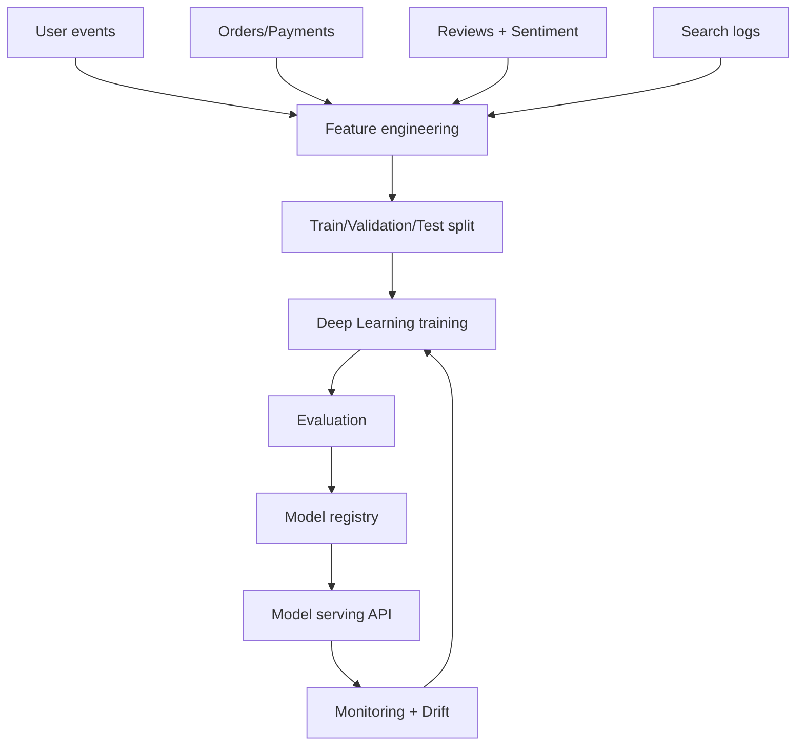
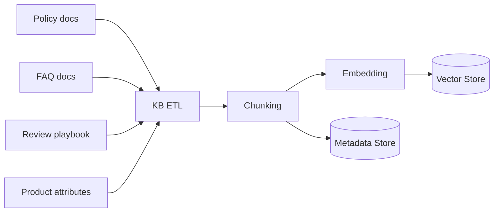
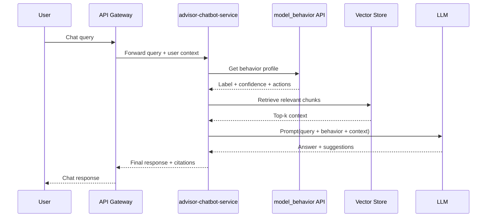
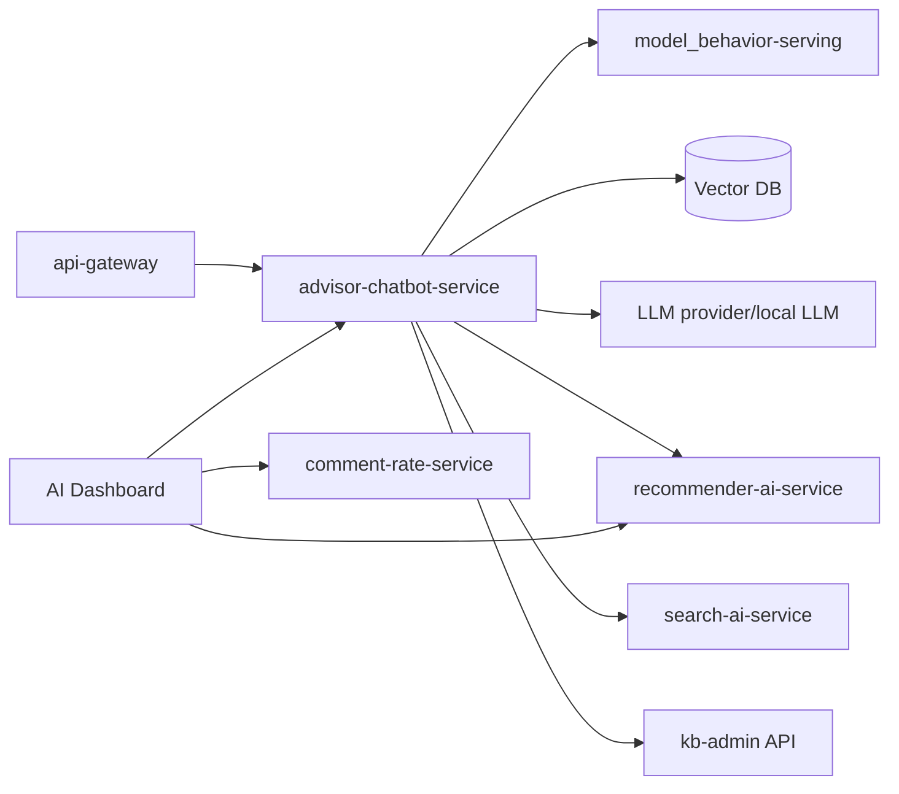
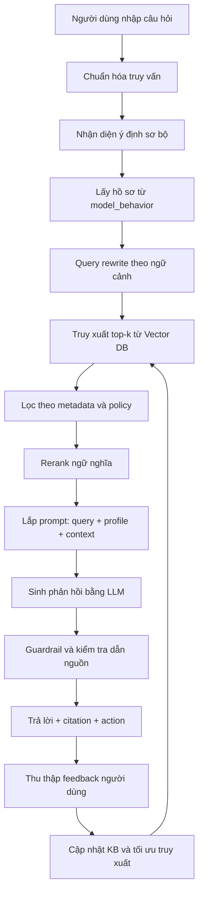
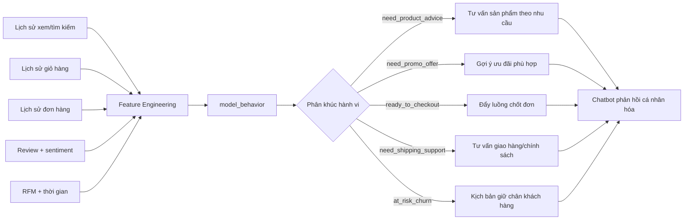

# BÁO CÁO CHUYÊN ĐỀ
## AI Chatbot Trong Hệ Thống E-commerce Book Store

## Thông tin tài liệu
- Chủ đề: Phân tích hành vi khách hàng để tư vấn dịch vụ bằng AI Chatbot
- Bối cảnh áp dụng: Hệ thống Book Store theo kiến trúc microservices
- Mục tiêu: Nâng cao chuyển đổi, tăng mức độ hài lòng khách hàng, giảm chi phí vận hành hỗ trợ, và hình thành nền tảng AI có khả năng mở rộng

---

## Tóm tắt
Báo cáo này trình bày một lộ trình đầy đủ từ khảo sát ứng dụng AI trong thương mại điện tử đến thiết kế và tích hợp chatbot tư vấn cho hệ thống Book Store. Trọng tâm kỹ thuật gồm bốn cấu phần chính: (1) mô hình sâu `model_behavior` để nhận diện ý định dịch vụ và hành vi mua sắm, (2) Knowledge Base (KB) phục vụ tư vấn có kiểm soát, (3) kiến trúc RAG (Retrieval-Augmented Generation) nhằm tạo phản hồi có căn cứ, và (4) triển khai tích hợp thực tế vào nền tảng microservices hiện hữu. Báo cáo cũng đề xuất bộ KPI đánh giá hiệu quả kinh doanh, hiệu quả mô hình và hiệu quả vận hành để đảm bảo giải pháp có giá trị thực tiễn và khả năng mở rộng dài hạn.

**Từ khóa:** E-commerce, AI Chatbot, Deep Learning, RAG, Knowledge Base, Recommendation, Semantic Search.

---

## Mục lục đề xuất
1. Khảo sát các áp dụng AI trong e-commerce (quy mô tương đương 5 trang)
2. Xây dựng ứng dụng “Phân tích hành vi khách hàng để tư vấn dịch vụ”
   - 2.1. Phân tích hệ thống Book Store hiện tại
   - 2.2. Xây dựng mô hình `model_behavior` dựa trên Deep Learning
   - 2.3. Xây dựng KB (Knowledge Base) cho tư vấn
   - 2.4. Áp dụng RAG để xây dựng chatbot tư vấn
   - 2.5. Deploy và tích hợp trong hệ e-commerce
3. Đánh giá hiệu quả và lộ trình mở rộng
4. Phụ lục (API, quy trình, mẫu triển khai)

---

# 1. Khảo sát các áp dụng AI trong e-commerce

## 1.1. Bối cảnh và động lực ứng dụng AI
Thương mại điện tử đã chuyển từ giai đoạn “số hóa gian hàng” sang giai đoạn “tối ưu toàn trình khách hàng”. Trong bối cảnh cạnh tranh cao, AI không còn là tính năng phụ trợ mà trở thành năng lực lõi giúp doanh nghiệp:
- Hiểu đúng nhu cầu người dùng theo ngữ cảnh thời gian thực.
- Cá nhân hóa trải nghiệm tìm kiếm, gợi ý và chăm sóc.
- Tối ưu hiệu quả vận hành chuỗi cung ứng và dịch vụ hậu mãi.
- Giảm rủi ro gian lận, nội dung xấu và khiếu nại kéo dài.

Đối với hệ Book Store đa danh mục (sách, thời trang, gia dụng, điện tử, làm đẹp, tiêu dùng, thể thao), AI đóng vai trò “lớp quyết định thông minh” liên kết dữ liệu giữa các dịch vụ.

## 1.2. Nhóm ứng dụng AI cho Discovery và Conversion

### 1.2.1. Semantic Search
Tìm kiếm từ khóa thuần văn bản thường bỏ sót ý định người dùng. Semantic Search cải thiện bằng cách:
- Hiểu nghĩa truy vấn thay vì chỉ khớp ký tự.
- Mở rộng đồng nghĩa, biến thể cách gọi sản phẩm.
- Xếp hạng kết quả theo mức liên quan ngữ nghĩa.

**Tác động kỳ vọng:** tăng Search CTR, tăng Add-to-Cart rate, giảm Search Abandonment.

### 1.2.2. Recommendation Engine
Gợi ý sản phẩm là đòn bẩy chuyển đổi quan trọng. Các kỹ thuật phổ biến gồm:
- Collaborative Filtering.
- Content-based Recommendation.
- Hybrid Recommendation (kết hợp hành vi, rating, sentiment, ngữ cảnh).

Mô hình hybrid đặc biệt phù hợp hệ Book Store đa danh mục vì hỗ trợ tốt bài toán cross-sell.

### 1.2.3. Dynamic Merchandising
AI sắp xếp thứ tự hiển thị theo mục tiêu kinh doanh:
- Ưu tiên SKU có xác suất chuyển đổi cao.
- Cân bằng lợi nhuận và tốc độ bán.
- Tối ưu theo mùa vụ và chiến dịch.

## 1.3. Nhóm ứng dụng AI cho Trust và Product Understanding

### 1.3.1. Review Intelligence
Dữ liệu đánh giá khách hàng là nguồn “Voice of Customer” có giá trị cao. AI có thể:
- Chấm điểm cảm xúc (sentiment score).
- Trích xuất khía cạnh (aspect extraction).
- Đưa ra khuyến nghị hành động cho vận hành.

**Giá trị quản trị:** phát hiện sớm vấn đề chất lượng theo SKU, rút ngắn thời gian xử lý sự cố dịch vụ.

### 1.3.2. Phát hiện review bất thường
Mục tiêu là giảm tác động của đánh giá giả hoặc thao túng bằng cách theo dõi:
- Mẫu câu lặp, bất thường ngôn ngữ.
- Cụm thời gian đăng dày đặc.
- Mối liên hệ tài khoản có rủi ro.

## 1.4. Nhóm ứng dụng AI cho Pricing và Promotion

### 1.4.1. Price Elasticity
Mô hình đàn hồi giá giúp doanh nghiệp:
- Xác định mức giá tối ưu theo phân khúc.
- Tránh giảm giá quá mức gây bào mòn biên lợi nhuận.

### 1.4.2. Promotion Targeting
AI chọn đúng đối tượng, đúng sản phẩm, đúng thời điểm để gửi ưu đãi.

**KPI liên quan:** Incremental Revenue, Promotion ROI, Repeat Purchase Rate.

## 1.5. Nhóm ứng dụng AI cho vận hành chuỗi cung ứng
- Dự báo nhu cầu (Demand Forecasting).
- Dự báo giao hàng chậm và rủi ro logistics.
- Chấm điểm rủi ro hoàn/trả để giảm thất thoát.

## 1.6. AI cho chăm sóc khách hàng và giữ chân
- Chatbot/Agent hỗ trợ tự động đa kênh.
- Triage ticket thông minh.
- Dự báo rời bỏ (churn) để kích hoạt chiến dịch giữ chân.

## 1.7. AI cho quản trị rủi ro và tuân thủ
- Phát hiện gian lận thanh toán.
- Kiểm duyệt nội dung.
- Explainability và audit trail.
- Chính sách bảo vệ dữ liệu cá nhân.

## 1.8. Kết luận phần khảo sát
Trong bối cảnh Book Store hiện tại, thứ tự ưu tiên khả thi cao gồm:
1. Review Intelligence (đã triển khai).
2. Hybrid Recommendation (đã triển khai).
3. Semantic Search (đã triển khai).
4. AI Chatbot tư vấn dựa trên hành vi + RAG (mục tiêu của báo cáo này).

---

# 2. Xây dựng ứng dụng “Phân tích hành vi khách hàng để tư vấn dịch vụ”

## 2.1. Phân tích hệ thống Book Store hiện tại
Hệ thống đang vận hành theo microservices và đã có các thành phần AI nền tảng:
- `comment-rate-service`: sentiment, aspect, advice.
- `recommender-ai-service`: recommendation, drift monitoring, retrain.
- `search-ai-service`: semantic retrieval.
- `rabbitmq` + worker: event-driven pipeline.

### Hình 1. Kiến trúc tổng quan và vị trí AI Chatbot
```mermaid
flowchart LR
    U[Người dùng Web] --> G[api-gateway]
    G --> AUTH[auth-service]
    G --> CART[cart-service]
    G --> ORD[order-service]
    G --> CAT[catalog-service]

    CAT --> BOOK[book-service]
    CAT --> FASHION[fashion-service]
    CAT --> HOUSE[household-service]
    CAT --> ELEC[electronics-service]
    CAT --> BEAUTY[beauty-service]
    CAT --> GROCERY[grocery-service]
    CAT --> SPORTS[sports-service]

    G --> SEARCH[search-ai-service]
    G --> REVIEW[comment-rate-service]
    G --> REC[recommender-ai-service]

    REVIEW --> MQ[(RabbitMQ)]
    MQ --> WORKER[recommender-ai-worker]
    WORKER --> REC

    G --> CHAT[advisor-chatbot-service (đề xuất)]
    CHAT --> KB[(Knowledge Base)]
    CHAT --> MB[model_behavior]
    CHAT --> SEARCH
    CHAT --> REC
```

### Hình 1A. Sơ đồ kiến trúc microservice e-commerce tích hợp AI (chi tiết)
```mermaid
flowchart LR
    subgraph CLIENT["Lớp người dùng"]
        WEB[Web/Mobile]
        STAFFUI[Staff/Manager Portal]
    end

    subgraph EDGE["Lớp truy cập"]
        GW[api-gateway]
    end

    subgraph CORE["Microservices nghiệp vụ e-commerce"]
        AUTH[auth-service]
        CUS[customer-service]
        CART[cart-service]
        CAT[catalog-service]
        BOOK[book-service]
        FASHION[fashion-service]
        HOUSE[household-service]
        ELEC[electronics-service]
        BEAUTY[beauty-service]
        GROCERY[grocery-service]
        SPORTS[sports-service]
        ORD[order-service]
        PAY[pay-service]
        SHIP[ship-service]
        STAFFSVC[staff-service]
        MGR[manager-service]
    end

    subgraph AI["Lớp AI/ML"]
        REVIEW[comment-rate-service\nReview Intelligence]
        REC[recommender-ai-service]
        WORKER[recommender-ai-worker]
        SEARCH[search-ai-service]
        CHAT[advisor-chatbot-service\n(đề xuất)]
        BEH[model_behavior-serving\n(đề xuất)]
        KB[(Knowledge Base)]
        VDB[(Vector DB)]
    end

    subgraph PLATFORM["Hạ tầng sự kiện và quan sát"]
        MQ[(RabbitMQ)]
        OBS[(Metrics / Logs / Traces)]
    end

    WEB --> GW
    STAFFUI --> GW

    GW --> AUTH
    GW --> CUS
    GW --> CART
    GW --> CAT
    GW --> ORD
    GW --> STAFFSVC
    GW --> MGR

    CAT --> BOOK
    CAT --> FASHION
    CAT --> HOUSE
    CAT --> ELEC
    CAT --> BEAUTY
    CAT --> GROCERY
    CAT --> SPORTS

    ORD --> PAY
    ORD --> SHIP

    GW --> REVIEW
    GW --> REC
    GW --> SEARCH
    GW --> CHAT

    REVIEW --> MQ
    MQ --> WORKER
    WORKER --> REC

    CHAT --> BEH
    CHAT --> KB
    CHAT --> VDB
    CHAT --> SEARCH
    CHAT --> REC
    CHAT --> REVIEW

    AUTH --> OBS
    GW --> OBS
    ORD --> OBS
    REVIEW --> OBS
    REC --> OBS
```

### Khoảng trống cần bổ sung
- Chưa có lớp hội thoại thống nhất cho tư vấn trước, trong và sau mua.
- Chưa có mô hình hành vi chuyên biệt để định tuyến chiến lược tư vấn.
- Chưa có cơ chế RAG chuẩn hóa cho phản hồi có dẫn nguồn.

## 2.2. Xây dựng mô hình `model_behavior` dựa trên Deep Learning

### 2.2.1. Mục tiêu mô hình
`model_behavior` dự báo “ý định dịch vụ” và “hành động khuyến nghị tiếp theo” cho từng phiên tương tác.

**Nhãn mục tiêu ví dụ:**
- `need_product_advice`
- `need_shipping_support`
- `need_promo_offer`
- `at_risk_churn`
- `ready_to_checkout`

### 2.2.2. Đầu vào dữ liệu
- Lịch sử browse/click/search.
- Hành vi giỏ hàng (thêm, xóa, bỏ dở).
- Lịch sử mua hàng và phản hồi.
- Đặc trưng RFM (Recency, Frequency, Monetary).
- Đặc trưng ngữ cảnh thời gian.

### 2.2.3. Kiến trúc deep learning đề xuất
- Embedding cho event type, category, thiết bị.
- Encoder chuỗi (GRU/LSTM hoặc Transformer encoder).
- Dense tower cho đặc trưng tổng hợp.
- Fusion layer + softmax đa lớp.

### Hình 2. Pipeline huấn luyện `model_behavior`


### 2.2.4. Tiêu chí huấn luyện và đánh giá
- Loss: Weighted Cross Entropy hoặc Focal Loss.
- Metric chính: Macro F1, Recall theo lớp.
- Chia tập theo thời gian (time-based split).
- Theo dõi drift định kỳ theo tuần/tháng.

### 2.2.5. Đầu ra phục vụ chatbot
- `behavior_label`
- `confidence_score`
- `top_k_intents`
- `recommended_action`

Ví dụ:
- Nhãn: `need_product_advice`
- Độ tin cậy: 0.83
- Hành động: gợi ý combo và sản phẩm best-seller theo danh mục.

## 2.3. Xây dựng KB (Knowledge Base) cho tư vấn

### 2.3.1. Mục tiêu
KB cung cấp nguồn tri thức chuẩn hóa để chatbot trả lời chính xác, nhất quán và có thể kiểm chứng.

### 2.3.2. Nguồn tri thức
- Chính sách giao hàng, đổi trả, thanh toán.
- FAQ chăm sóc khách hàng.
- Product taxonomy và metadata.
- Playbook review intelligence (delivery, quality, pricing...).
- Quy trình xử lý sự cố vận hành.

### 2.3.3. Cấu trúc metadata tối thiểu
- `doc_id`, `title`, `content`.
- `category`, `tags`.
- `owner_team`, `updated_at`.
- `confidence_level`, `version`.

### 2.3.4. Chuẩn hóa dữ liệu retrieval
- Chunk size: 400–800 tokens.
- Overlap: 50–100 tokens.
- Lọc theo metadata trước retrieval.
- Đánh chỉ mục vector + chỉ mục metadata.

### Hình 3. Pipeline tri thức cho chatbot


## 2.4. Áp dụng RAG để xây dựng chatbot tư vấn

### 2.4.1. Bài toán kỹ thuật
Chatbot cần đồng thời:
- Hiểu câu hỏi người dùng.
- Nắm trạng thái hành vi từ `model_behavior`.
- Truy xuất tri thức liên quan từ KB.
- Sinh phản hồi có căn cứ và đề xuất hành động.

### 2.4.2. Luồng xử lý RAG đề xuất
1. Tiếp nhận câu hỏi tại gateway.
2. Chatbot service chuẩn hóa truy vấn.
3. Gọi `model_behavior` để lấy hồ sơ hành vi.
4. Tạo truy vấn retrieval (query rewrite + metadata filter).
5. Lấy top-k context từ vector store.
6. Lắp prompt gồm truy vấn + hồ sơ + context.
7. Sinh phản hồi bằng LLM.
8. Áp dụng guardrail, policy check, citation check.
9. Trả phản hồi và hành động gợi ý.

### Hình 4. Pipeline RAG cho tư vấn hội thoại


### 2.4.3. Prompting và guardrail
- Prompt 3 lớp: system, business, safety.
- Bắt buộc dẫn nguồn cho phản hồi chính sách/khuyến nghị.
- Fallback chuyển người thật khi confidence thấp.
- Lọc nội dung vượt policy và nội dung nhạy cảm.

## 2.5. Deploy và tích hợp vào hệ e-commerce

### 2.5.1. Dịch vụ đề xuất mới
`advisor-chatbot-service` với API:
- `POST /chat/advice`
- `POST /chat/feedback`
- `GET /chat/health`

Kết nối nội bộ:
- `auth-service` để xác thực.
- `recommender-ai-service` cho cá nhân hóa.
- `search-ai-service` cho truy xuất bổ sung.
- `model_behavior-serving` và KB store.

### 2.5.2. Mô hình triển khai
- Giai đoạn đầu: Docker Compose để đồng bộ môi trường.
- Giai đoạn mở rộng: Kubernetes + autoscaling + observability.

### Hình 5. Kiến trúc triển khai chatbot AI


### 2.5.3. Tích hợp UI vào Book Store
- Widget chat tại trang shop.
- “Bạn có thể hỏi” tại product detail.
- Hỗ trợ chat ở trang cart/checkout.

### 2.5.4. Bảo mật và tuân thủ
- Ẩn/che thông tin định danh cá nhân trước khi log.
- Xác thực token nội bộ (`X-Service-Token`).
- Kiểm soát quyền cập nhật KB theo vai trò.
- Lưu audit log cho thay đổi model và tri thức.

---

# 3. Đánh giá hiệu quả và lộ trình mở rộng

## 3.1. Bộ KPI đánh giá

### 3.1.1. KPI kinh doanh
- Chat-assisted conversion rate.
- Add-to-cart rate sau phiên chat.
- AOV (Average Order Value) sau phiên chat.
- Tỷ lệ mua lại 30 ngày.

### 3.1.2. KPI mô hình AI
- Intent classification Macro F1 (`model_behavior`).
- Retrieval Precision@k.
- Grounded response rate.
- Hallucination incident rate.

### 3.1.3. KPI vận hành
- P95 latency.
- Error rate.
- Uptime/SLA.
- MTTR.

## 3.2. Lộ trình 3 giai đoạn

### Giai đoạn 1 (0–4 tuần)
- Chuẩn hóa KB.
- Xây MVP `advisor-chatbot-service`.
- Tích hợp giao diện chat tại shop.

### Giai đoạn 2 (5–10 tuần)
- Huấn luyện `model_behavior` v1.
- Kết nối chặt recommendation + search.
- Triển khai dashboard chất lượng hội thoại.

### Giai đoạn 3 (11–16 tuần)
- A/B testing theo nhóm khách hàng.
- Tối ưu prompt, retrieval và reranking.
- Mở rộng đa kênh (web, app, voice).

---

# 4. Phụ lục

## 4.1. Hợp đồng API tối thiểu cho chatbot
- `POST /chat/advice`
  - Input: `user_id`, `session_id`, `query`, `channel`, `locale`.
  - Output: `answer`, `citations`, `actions`, `confidence`, `handoff_flag`.

- `POST /chat/feedback`
  - Input: `session_id`, `message_id`, `rating`, `comment`.
  - Output: `status`.

## 4.2. Mẫu payload phản hồi
- `answer`: nội dung trả lời.
- `citations`: danh sách nguồn tham chiếu.
- `actions`: gợi ý hành động tiếp theo.

## 4.3. Quy trình cập nhật KB
1. Team nghiệp vụ cập nhật tài liệu nguồn.
2. KB admin duyệt và chuẩn hóa metadata.
3. Chạy ETL chunking + embedding.
4. Xuất bản index mới.
5. Theo dõi metric retrieval sau phát hành.

## 4.4. Biểu đồ luồng RAG (chi tiết)


## 4.5. Biểu đồ phân tách hành vi khách hàng


---

## Kết luận
Báo cáo đề xuất một cách tiếp cận có tính hệ thống để xây dựng AI Chatbot cho Book Store: tận dụng nền tảng AI hiện có (review intelligence, semantic search, recommendation, event pipeline), đồng thời bổ sung lớp hành vi khách hàng (`model_behavior`), tri thức có cấu trúc (KB) và RAG để tạo phản hồi tư vấn có căn cứ. Kiến trúc đề xuất đảm bảo tính khả thi triển khai, khả năng mở rộng và khả năng đo lường hiệu quả theo KPI phục vụ mục tiêu kinh doanh.
