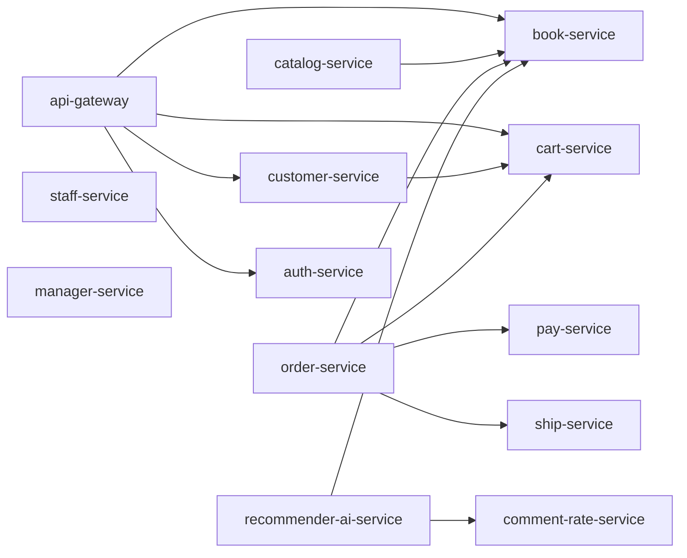

# Bookstore Microservice Architecture

## Overview

## Service Boundaries

- `api-gateway`: server-rendered UI and request entry point for browsing books and carts.
- `customer-service`: customer registration and lookup. Customer creation also creates a cart.
- `cart-service`: cart ownership, add/update/delete cart items, view cart by customer.
- `book-service`: CRUD for books.
- `catalog-service`: local read model synchronized from `book-service`.
- `order-service`: order orchestration across cart, payment, and shipping.
- `pay-service`: payment reservation and cancellation.
- `ship-service`: shipment reservation and cancellation.
- `comment-rate-service`: customer ratings and reviews for books.
- `recommender-ai-service`: basic recommendation generation from reviews and catalog data.
- `staff-service`: staff directory.
- `manager-service`: manager directory.
- `auth-service`: centralized JWT auth (register/login/refresh/verify) and role sync endpoint.

## Gateway Modules

- Authentication: login/register/logout with Django session auth.
- Role-based UI: `Admin`, `Staff`, `Customer` via Django Groups.
- Customer storefront: `/shop/` for multi-category product browsing (sach, quan ao, gia dung, dien tu).
- Product detail: `/shop/<product_id>/` with rich product information and add-to-cart.
- Favorites: `/customer/<customer_id>/favorites/` with quick add/remove wishlist flow.
- Checkout workspace: `/customer/cart/<customer_id>/` for order + review flow.
- Admin access control: `/admin/users/` for assigning roles to users.
- Operations dashboard: `/staff/health/` for per-service health checks.

## Current Transaction Flow

1. Customer is created in `customer-service`.
2. `customer-service` calls `cart-service` to create a cart.
3. Customer adds items in `cart-service`.
4. `order-service` reads cart data and book prices.
5. `order-service` reserves payment in `pay-service`.
6. `order-service` reserves shipping in `ship-service`.
7. If both reservations succeed, the order is confirmed.
8. If a reservation fails, successful downstream reservations are cancelled.

## Assignment 06 Gap

- Order orchestration is synchronous REST compensation, not a message-broker Saga yet.
- JWT auth-service, rate limiting, centralized logging, and metrics are not implemented yet.
- RabbitMQ or Kafka integration is still pending.

## Security + Observability Additions

- Service-to-service protection with shared token header (`X-Service-Token`) for internal APIs.
- Gateway request telemetry middleware with request id, latency, status counters, and recent traces.
- Staff operations endpoints for metrics/traces: `/staff/ops/metrics/`, `/staff/ops/traces/`.
- Auth hardening: default admin seed command and role-sync endpoint protected by `AUTH_ADMIN_TOKEN`.
- Session hardening: gateway verifies access token and auto-refreshes via auth-service.
- Basic brute-force protection: rate limit on auth-service login/register and gateway login endpoint.