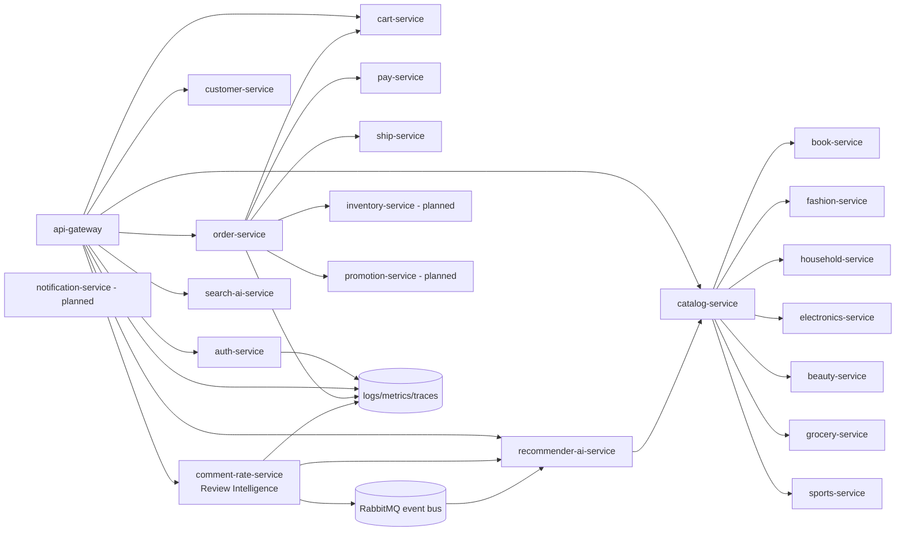

# Bookstore -> Full E-commerce Microservices Architecture

## 1) Current Core Domain

The current repository already covers the key customer journey:

- storefront and account access via api-gateway
- customer profile and cart lifecycle
- product catalogs (books + fashion + household + electronics + beauty + grocery + sports)
- order orchestration + payment + shipping
- review/rating collection
- recommendation + semantic search services

This makes it a strong foundation to evolve into a full e-commerce platform.

## 2) Target Architecture (Production Shape)

## 3) Bounded Contexts

- Identity and Access: auth-service
- Customer and Profile: customer-service
- Product Domain: book/fashion/household/electronics/beauty/grocery/sports + catalog-service
- Cart and Checkout: cart-service + order-service
- Payment and Fulfillment: pay-service + ship-service
- Experience Intelligence (AI): comment-rate-service + recommender-ai-service + search-ai-service
- Ops and Governance: staff-service + manager-service + observability endpoints

## 4) AI Integration Strategy In This Repo

### AI Service chosen for implementation

The selected service is comment-rate-service, upgraded into Review Intelligence Service.

What was added:

- deep-learning sentiment scoring per review (tiny 2-layer neural network)
- aspect extraction based on a domain knowledge base
- advisory action generation for business teams
- aggregated insights endpoint for product/global review health
- RabbitMQ event publication for review events
- worker-based drift snapshot updates and manual retrain trigger endpoint
- semantic search service across all product categories

### Why this service first

- review data is high-signal, low-latency for product feedback loops
- immediately impacts recommendation quality and conversion
- can feed operations teams (quality, logistics, customer care)

## 5) Standard Microservice Design Checklist

For each service in this platform:

- owns its own schema and migrations
- health endpoint + internal auth header validation
- clear API contracts and versioning
- idempotent writes where applicable
- timeout/retry policy for service calls
- telemetry: latency/error counters and trace correlation
- deployment contract via docker-compose and per-service Dockerfile

## 6) Next Evolution Steps

1. Move synchronous compensation in order-service to fully message-driven saga.
2. Add inventory-service and promotion-service as independent bounded contexts.
3. Upgrade search-ai-service from token semantic matching to vector retrieval + reranking.
4. Add feature store for AI services (review features, user behavior features).
5. Introduce model registry and scheduled re-training pipeline.
6. Add SLO and alerting for critical paths (checkout and payment).

## 7) AI Governance Basics

- Keep explainability payload in each AI-scored review.
- Track model type and training sample size in status endpoint.
- Keep a human-readable knowledge base for aspect/action mapping.
- Monitor drift: average sentiment vs average rating divergence.