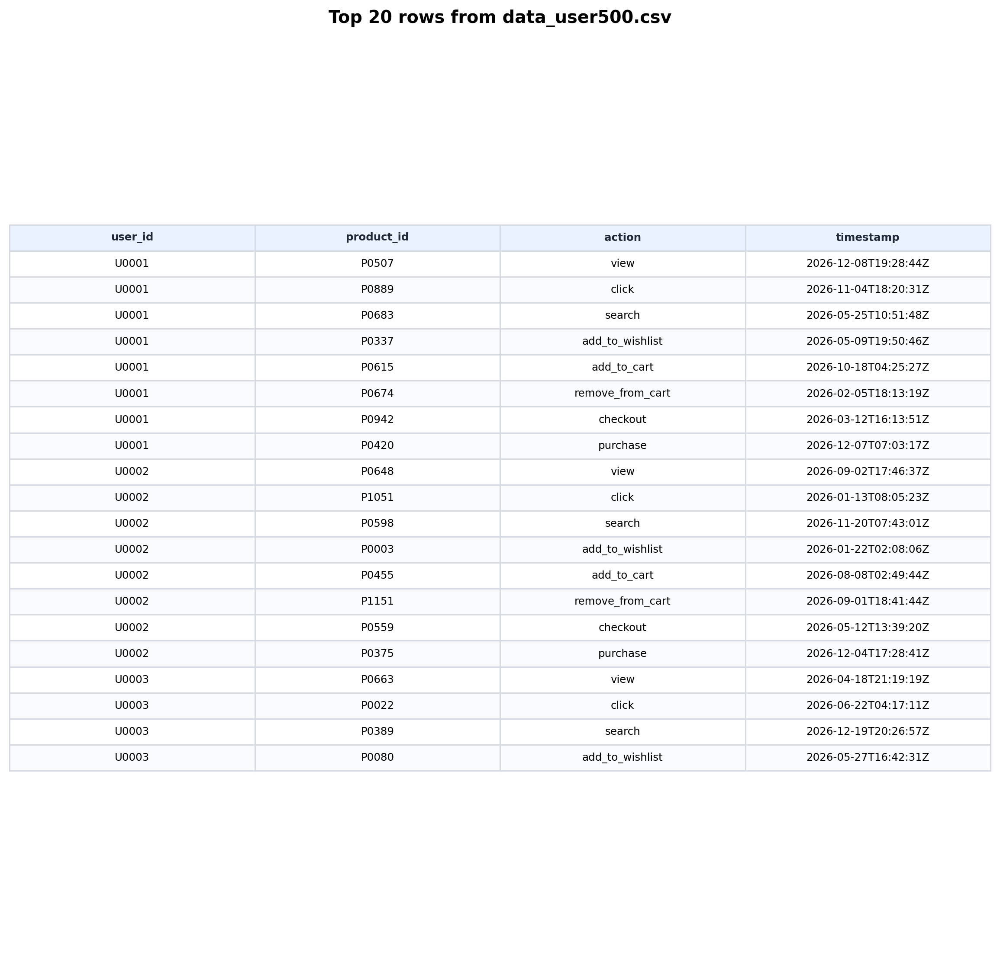
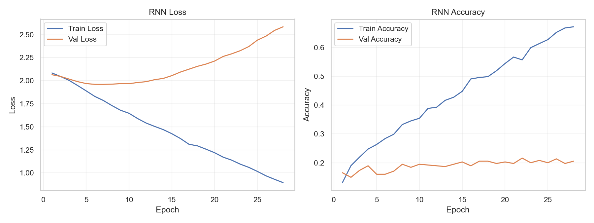
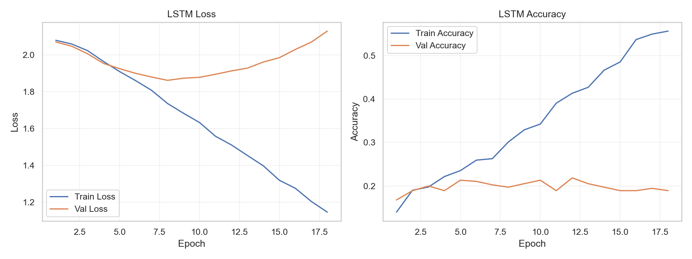
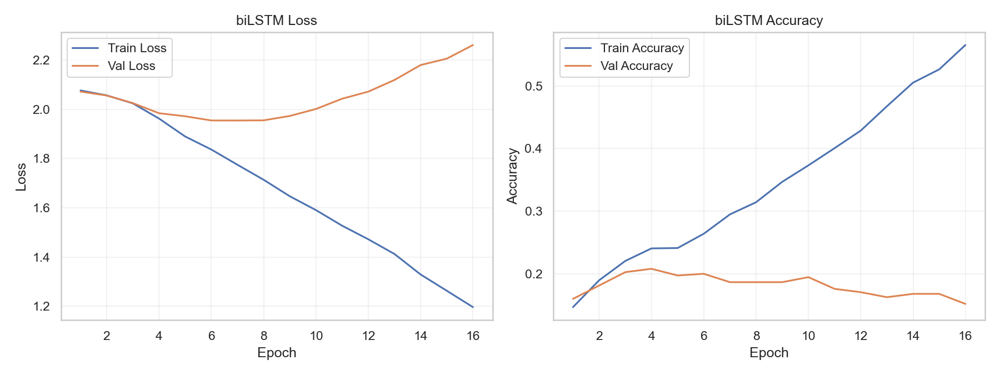
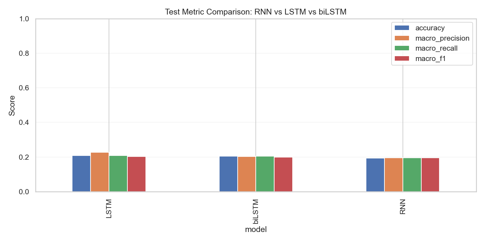
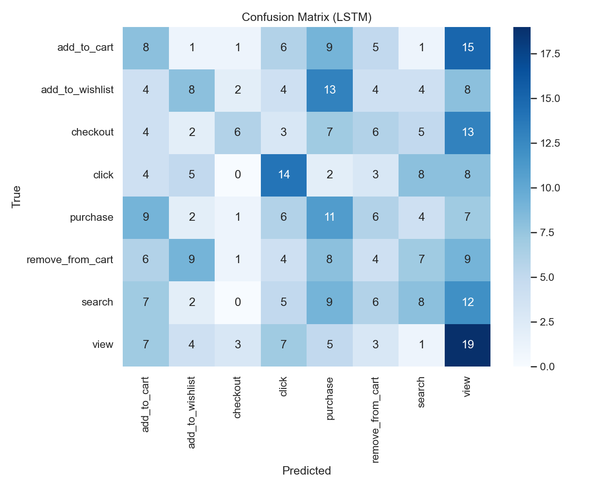
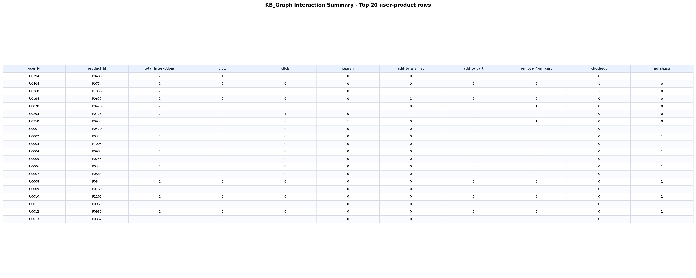
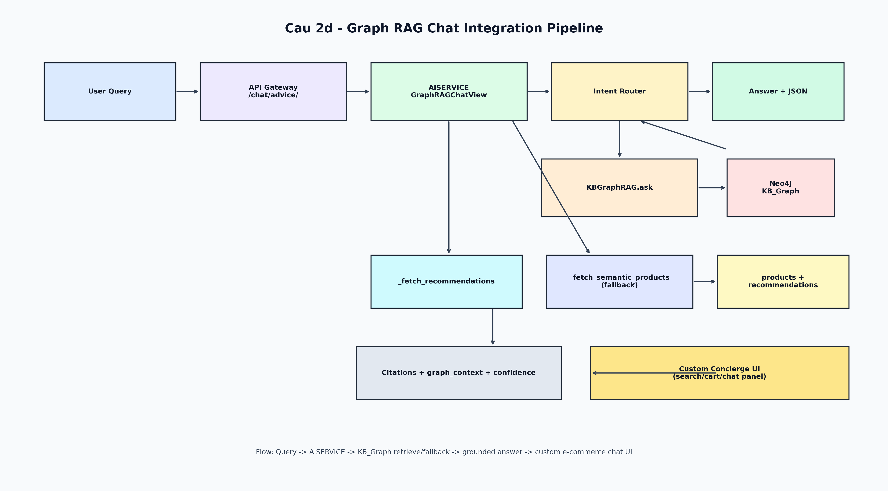

# 1. TRANG BIA

**TRUONG / KHOA:** ..........................................................

**MON HOC:** He thong thong tin / Thuong mai dien tu

**DE TAI:** Tich hop ai-service, KB_Graph va Graph-RAG Chat vao he e-commerce

**BAO CAO:** Cau 2a, 2c, 2d

**Sinh vien:** ..........................................................

**MSSV:** ..........................................................

**Lop:** ..........................................................

**Giang vien huong dan:** ..........................................................

**Ngay nop:** 21/04/2026

---

# 2. MO TA ai-service

ai-service la service AI trung tam, da gom nhat tu cac service AI roi rac truoc day (review intelligence, recommendation, semantic search, chatbot), va bo sung them Graph-RAG truy xuat tri thuc tu Neo4j.

## 2.1 Muc tieu

- Dong nhat mot diem truy cap AI cho API Gateway.
- Giam do phuc tap van hanh (1 service thay vi nhieu AI service tach roi).
- Tang kha nang mo rong chatbot nho ket hop Semantic + Recommendation + KB_Graph.

## 2.2 Thanh phan chinh trong ai-service

- Xu ly review + sentiment: `ReviewListCreate`, `ReviewInsights`, `ReviewModelStatus`.
- Recommendation: `RecommendationView`.
- Drift monitor + retrain trigger: `DriftStatusView`, `RetrainTriggerView`.
- Semantic search: `SemanticSearchView`.
- Chatbot:
  - `ChatAdviceView` (semantic/policy flow).
  - `GraphRAGChatView` (Graph-RAG tren Neo4j, co fallback semantic).
- Engine truy xuat graph: lop `KBGraphRAG`.

## 2.3 API endpoint chinh

| Endpoint | Chuc nang |
|---|---|
| `/health/` | Health check ai-service |
| `/search/semantic/` | Tim kiem semantic |
| `/recommendations/{customer_id}/` | Goi y san pham |
| `/ai/drift/` | Trang thai drift mo hinh |
| `/ai/retrain/` | Trigger retrain |
| `/reviews/` | CRUD review + enrich AI |
| `/reviews/insights/` | Tong hop review insight |
| `/reviews/model-status/` | Trang thai model review |
| `/chat/advice/` | Chat flow semantic/policy |
| `/chat/rag/graph/` | Chat flow Graph-RAG tren KB_Graph |

---

# 3. COPY 20 DONG DATA

Duoi day la **20 dong dau** (bao gom header) tu `data_user500.csv`:

```csv
"user_id","product_id","action","timestamp"
"U0001","P0507","view","2026-12-08T19:28:44Z"
"U0001","P0889","click","2026-11-04T18:20:31Z"
"U0001","P0683","search","2026-05-25T10:51:48Z"
"U0001","P0337","add_to_wishlist","2026-05-09T19:50:46Z"
"U0001","P0615","add_to_cart","2026-10-18T04:25:27Z"
"U0001","P0674","remove_from_cart","2026-02-05T18:13:19Z"
"U0001","P0942","checkout","2026-03-12T16:13:51Z"
"U0001","P0420","purchase","2026-12-07T07:03:17Z"
"U0002","P0648","view","2026-09-02T17:46:37Z"
"U0002","P1051","click","2026-01-13T08:05:23Z"
"U0002","P0598","search","2026-11-20T07:43:01Z"
"U0002","P0003","add_to_wishlist","2026-01-22T02:08:06Z"
"U0002","P0455","add_to_cart","2026-08-08T02:49:44Z"
"U0002","P1151","remove_from_cart","2026-09-01T18:41:44Z"
"U0002","P0559","checkout","2026-05-12T13:39:20Z"
"U0002","P0375","purchase","2026-12-04T17:28:41Z"
"U0003","P0663","view","2026-04-18T21:19:19Z"
"U0003","P0022","click","2026-06-22T04:17:11Z"
"U0003","P0389","search","2026-12-19T20:26:57Z"
```

**Anh minh hoa 20 dong data:**



---

# 4. CAU 2a - LOI GIAI THICH + COPY CODE + ANH

## 4.1 Loi giai thich ngan gon

Muc tieu Cau 2a la huan luyen va danh gia 3 mo hinh sequence learning:

- RNN
- LSTM
- biLSTM

Bai toan duoc dat la: du doan hanh dong tiep theo cua user dua tren chuoi hanh vi truoc do (action, product, time features). Pipeline gom cac buoc:

1. Tien xu ly + tao sequence co do dai co dinh (`SEQ_LEN=3`).
2. Train/validation/test split co stratify.
3. Huan luyen 3 mo hinh voi early stopping.
4. So sanh metric: accuracy, macro-precision, macro-recall, macro-f1.
5. Chon `model_best` theo macro_f1 roi luu artifact.

## 4.2 Ket qua metric

| Model | Accuracy | Macro Precision | Macro Recall | Macro F1 |
|---|---:|---:|---:|---:|
| LSTM | 0.2080 | 0.2274 | 0.2083 | 0.2024 |
| biLSTM | 0.2053 | 0.2028 | 0.2050 | 0.1995 |
| RNN | 0.1947 | 0.1952 | 0.1958 | 0.1952 |

**Ket luan:** LSTM duoc chon lam `model_best`.

## 4.3 Copy code Cau 2a (trich doan cot loi)

```python
class ActionSequenceModel(nn.Module):
    def __init__(
        self,
        model_type,
        num_actions,
        num_products,
        time_dim,
        action_emb_dim=8,
        product_emb_dim=16,
        hidden_dim=64,
        dropout=0.2,
    ):
        super().__init__()
        self.model_type = model_type
        self.action_emb = nn.Embedding(num_actions, action_emb_dim)
        self.product_emb = nn.Embedding(num_products, product_emb_dim)

        input_dim = action_emb_dim + product_emb_dim + time_dim

        if model_type == "RNN":
            self.recurrent = nn.RNN(
                input_size=input_dim,
                hidden_size=hidden_dim,
                batch_first=True,
                nonlinearity="tanh",
            )
            out_dim = hidden_dim
        elif model_type == "LSTM":
            self.recurrent = nn.LSTM(
                input_size=input_dim,
                hidden_size=hidden_dim,
                batch_first=True,
            )
            out_dim = hidden_dim
        elif model_type == "biLSTM":
            self.recurrent = nn.LSTM(
                input_size=input_dim,
                hidden_size=hidden_dim,
                batch_first=True,
                bidirectional=True,
            )
            out_dim = hidden_dim * 2
        else:
            raise ValueError(f"Unsupported model_type: {model_type}")

        self.classifier = nn.Sequential(
            nn.Linear(out_dim, 64),
            nn.ReLU(),
            nn.Dropout(dropout),
            nn.Linear(64, num_actions),
        )

    def forward(self, action_seq, product_seq, time_seq):
        action_vec = self.action_emb(action_seq)
        product_vec = self.product_emb(product_seq)
        x = torch.cat([action_vec, product_vec, time_seq], dim=-1)
        recurrent_out, _ = self.recurrent(x)
        last_hidden = recurrent_out[:, -1, :]
        return self.classifier(last_hidden)
```

```python
for model_name in model_types:
    model = ActionSequenceModel(
        model_type=model_name,
        num_actions=len(action_to_idx),
        num_products=num_products,
        time_dim=time_seq.shape[-1],
    ).to(device)

    optimizer = torch.optim.Adam(model.parameters(), lr=LEARNING_RATE)

    best_state = copy.deepcopy(model.state_dict())
    best_val_f1 = -1.0
    no_improve = 0

    for epoch in range(1, EPOCHS + 1):
        train_loss, train_metrics = run_epoch(model, train_loader, criterion, optimizer, device, train_mode=True)
        val_loss, val_metrics = run_epoch(model, val_loader, criterion, optimizer, device, train_mode=False)

        if val_metrics["macro_f1"] > best_val_f1 + 1e-6:
            best_val_f1 = val_metrics["macro_f1"]
            best_state = copy.deepcopy(model.state_dict())
            no_improve = 0
        else:
            no_improve += 1

        if no_improve >= PATIENCE:
            break

    model.load_state_dict(best_state)
```

## 4.4 Anh ket qua Cau 2a











---

# 5. KB_GRAPH - COPY ANH 20 DONG + ANH GRAPH

## 5.1 Anh 20 dong du lieu cho KB_Graph



## 5.2 Anh graph KB_Graph (phuc tap)


---

# 6. CAU 2c, 2d - TAI LIEU + ANH

## 6.1 Cau 2c - Xay dung Knowledge Base Graph (KB_Graph)

### Muc tieu

- Chuyen tap log hanh vi thanh tri thuc co cau truc trong Neo4j.
- Phuc vu truy van behavior-level: top san pham, funnel, transition, time-slot.

### Mo hinh du lieu

- Node: `User`, `Product`, `Action`, `Event`, `TimeSlot`, `KBGraph`.
- Relationship:
  - `(:User)-[:PERFORMED]->(:Event)`
  - `(:Event)-[:OF_ACTION]->(:Action)`
  - `(:Event)-[:ON_PRODUCT]->(:Product)`
  - `(:Event)-[:IN_TIMESLOT]->(:TimeSlot)`
  - `(:User)-[:INTERACTED_WITH]->(:Product)`
  - `(:Action)-[:NEXT_ACTION]->(:Action)`

### Luong import

1. Doc CSV, chuan hoa timestamp.
2. Sinh event_id, timeslot key.
3. Upsert node/edge theo batch vao Neo4j.
4. Tong hop relation `INTERACTED_WITH` va `NEXT_ACTION`.
5. Ghi metadata node `KBGraph`.

### Anh minh hoa Cau 2c


## 6.2 Cau 2d - Graph-RAG chatbot va tich hop e-commerce

### Muc tieu

- Tra loi chat dua tren ngu canh tri thuc KB_Graph.
- Van dam bao fallback semantic neu graph tam thoi unavailable.
- Tra ve du lieu co citation + graph_context + recommendation de render tren UI chat custom.

### Luong xu ly

1. User gui query tu shop page chat panel.
2. API Gateway goi `/chat/advice/`.
3. ai-service vao `GraphRAGChatView`.
4. `KBGraphRAG.ask` detect intent va query Neo4j.
5. Hop nhat ket qua graph voi recommendation.
6. Tra JSON gom answer, confidence, citations, products, graph_context.
7. Frontend custom concierge UI render bong chat + mini list + citations.

### Gia tri ky thuat

- Tra loi co can cu (grounded) thay vi sinh tu do.
- Tuong thich nguyen sinh voi he e-commerce (search/cart/chat tren cung mot trang).
- De mo rong cho dashboard insight va phan tich funnel sau nay.

### Anh minh hoa Cau 2d



---

# KET LUAN NGAN

Tai lieu da hoan thanh dung theo 6 yeu cau:

1. Trang bia
2. Mo ta ai-service
3. Copy 20 dong data
4. Loi giai thich + code + anh cho Cau 2a
5. KB_Graph co anh 20 dong va anh graph phuc tap
6. Viet tai lieu Cau 2c, 2d kem anh minh hoa
