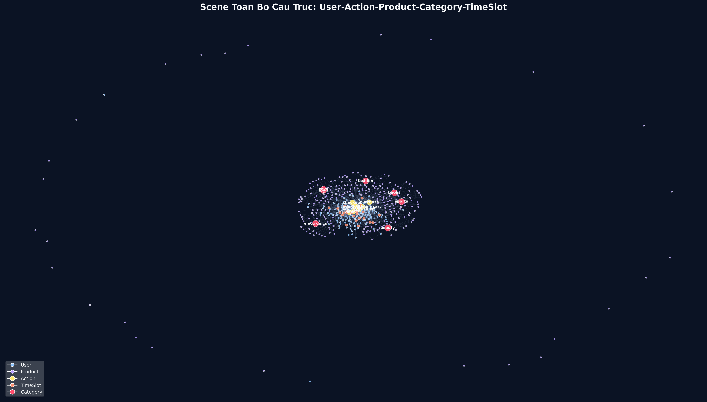
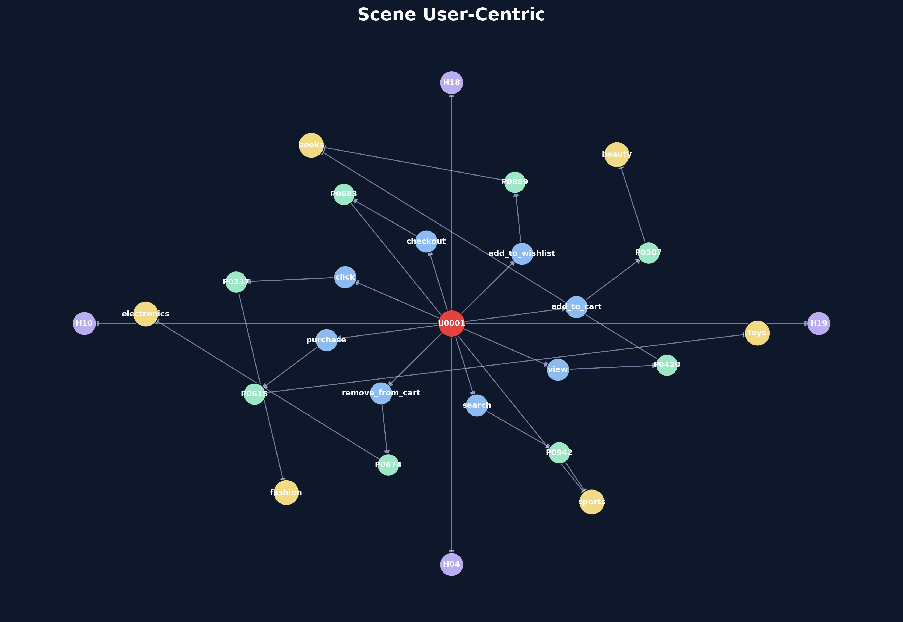
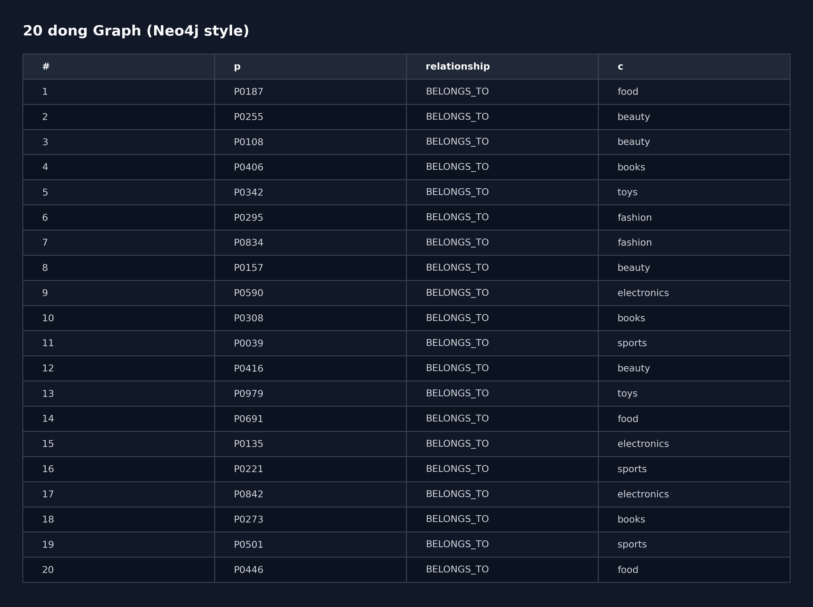
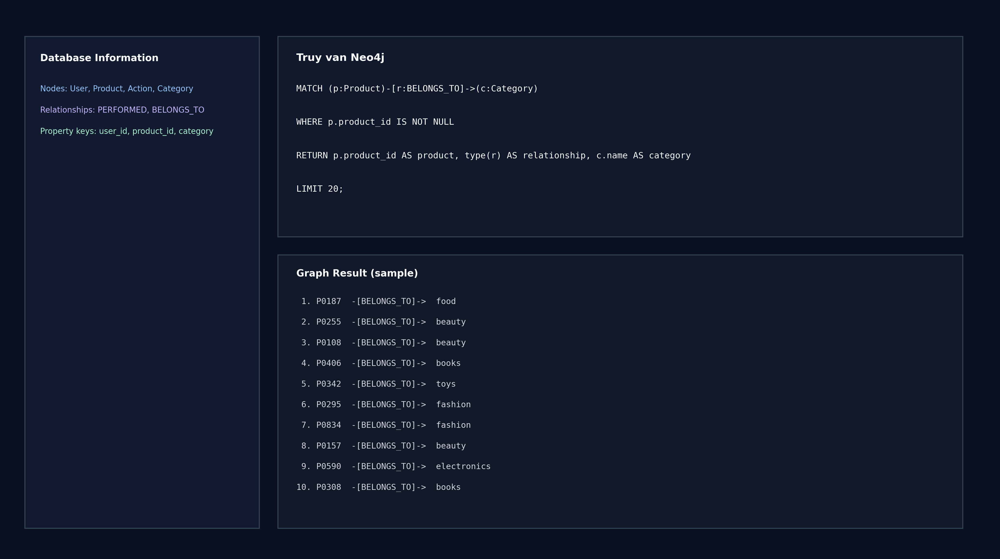

# 1. TRANG BÌA

**TRƯỜNG / KHOA:** ..........................................................

**MÔN HỌC:** Hệ thống thông tin / Thương mại điện tử

**ĐỀ TÀI:** Tích hợp ai-service, KB_Graph và Graph-RAG Chat vào hệ e-commerce

**BÁO CÁO:** Câu 2a, 2c, 2d

**Sinh viên:** ..........................................................

**MSSV:** ..........................................................

**Lớp:** ..........................................................

**Giảng viên hướng dẫn:** ..........................................................

**Ngày nộp:** 21/04/2026

---

# 2. MÔ TẢ ai-service

ai-service là service AI trung tâm, đã gom nhất từ các service AI rời rạc trước đây (review intelligence, recommendation, semantic search, chatbot), đồng thời bổ sung Graph-RAG để truy xuất tri thức từ Neo4j.

## 2.1 Mục tiêu

- Đồng nhất một điểm truy cập AI cho API Gateway.
- Giảm độ phức tạp vận hành (1 service thay vì nhiều AI service tách rời).
- Tăng khả năng mở rộng chatbot nhờ kết hợp Semantic + Recommendation + KB_Graph.

## 2.2 Thành phần chính trong ai-service

- Xử lý review + sentiment: `ReviewListCreate`, `ReviewInsights`, `ReviewModelStatus`.
- Recommendation: `RecommendationView`.
- Drift monitor + retrain trigger: `DriftStatusView`, `RetrainTriggerView`.
- Semantic search: `SemanticSearchView`.
- Chatbot:
  - `ChatAdviceView` (semantic/policy flow).
  - `GraphRAGChatView` (Graph-RAG trên Neo4j, có fallback semantic).
- Engine truy xuất graph: lớp `KBGraphRAG`.

## 2.3 API endpoint chính

| Endpoint | Chức năng |
|---|---|
| `/health/` | Health check ai-service |
| `/search/semantic/` | Tìm kiếm semantic |
| `/recommendations/{customer_id}/` | Gợi ý sản phẩm |
| `/ai/drift/` | Trạng thái drift mô hình |
| `/ai/retrain/` | Trigger retrain |
| `/reviews/` | CRUD review + enrich AI |
| `/reviews/insights/` | Tổng hợp review insight |
| `/reviews/model-status/` | Trạng thái model review |
| `/chat/advice/` | Chat flow semantic/policy |
| `/chat/rag/graph/` | Chat flow Graph-RAG trên KB_Graph |

---

# 3. COPY 20 DÒNG DATA

Dưới đây là **20 dòng đầu** (bao gồm header) từ `data_user500.csv`:

```csv
"user_id","product_id","action","timestamp"
"U0001","P0507","view","2026-12-08T19:28:44Z"
"U0001","P0889","click","2026-11-04T18:20:31Z"
"U0001","P0683","search","2026-05-25T10:51:48Z"
"U0001","P0337","add_to_wishlist","2026-05-09T19:50:46Z"
"U0001","P0615","add_to_cart","2026-10-18T04:25:27Z"
"U0001","P0674","remove_from_cart","2026-02-05T18:13:19Z"
"U0001","P0942","checkout","2026-03-12T16:13:51Z"
"U0001","P0420","purchase","2026-12-07T07:03:17Z"
"U0002","P0648","view","2026-09-02T17:46:37Z"
"U0002","P1051","click","2026-01-13T08:05:23Z"
"U0002","P0598","search","2026-11-20T07:43:01Z"
"U0002","P0003","add_to_wishlist","2026-01-22T02:08:06Z"
"U0002","P0455","add_to_cart","2026-08-08T02:49:44Z"
"U0002","P1151","remove_from_cart","2026-09-01T18:41:44Z"
"U0002","P0559","checkout","2026-05-12T13:39:20Z"
"U0002","P0375","purchase","2026-12-04T17:28:41Z"
"U0003","P0663","view","2026-04-18T21:19:19Z"
"U0003","P0022","click","2026-06-22T04:17:11Z"
"U0003","P0389","search","2026-12-19T20:26:57Z"
```

**Ảnh minh họa 20 dòng data:**


---

# 4. CÂU 2a - LỜI GIẢI THÍCH + COPY CODE + ẢNH

## 4.1 Lời giải thích ngắn gọn

Mục tiêu Câu 2a là huấn luyện và đánh giá 3 mô hình sequence learning:

- RNN
- LSTM
- biLSTM

Bài toán được đặt là: dự đoán hành động tiếp theo của user dựa trên chuỗi hành vi trước đó (action, product, time features). Pipeline gồm các bước:

1. Tiền xử lý + tạo sequence có độ dài cố định (`SEQ_LEN=3`).
2. Train/validation/test split có stratify.
3. Huấn luyện 3 mô hình với early stopping.
4. So sánh metric: accuracy, macro-precision, macro-recall, macro-f1.
5. Chọn `model_best` theo macro_f1 rồi lưu artifact.

## 4.2 Kết quả metric

| Model | Accuracy | Macro Precision | Macro Recall | Macro F1 |
|---|---:|---:|---:|---:|
| LSTM | 0.2080 | 0.2274 | 0.2083 | 0.2024 |
| biLSTM | 0.2053 | 0.2028 | 0.2050 | 0.1995 |
| RNN | 0.1947 | 0.1952 | 0.1958 | 0.1952 |

**Kết luận:** LSTM được chọn làm `model_best`.

## 4.3 Copy code Câu 2a (trích đoạn cốt lõi)

```python
class ActionSequenceModel(nn.Module):
    def __init__(
        self,
        model_type,
        num_actions,
        num_products,
        time_dim,
        action_emb_dim=8,
        product_emb_dim=16,
        hidden_dim=64,
        dropout=0.2,
    ):
        super().__init__()
        self.model_type = model_type
        self.action_emb = nn.Embedding(num_actions, action_emb_dim)
        self.product_emb = nn.Embedding(num_products, product_emb_dim)

        input_dim = action_emb_dim + product_emb_dim + time_dim

        if model_type == "RNN":
            self.recurrent = nn.RNN(
                input_size=input_dim,
                hidden_size=hidden_dim,
                batch_first=True,
                nonlinearity="tanh",
            )
            out_dim = hidden_dim
        elif model_type == "LSTM":
            self.recurrent = nn.LSTM(
                input_size=input_dim,
                hidden_size=hidden_dim,
                batch_first=True,
            )
            out_dim = hidden_dim
        elif model_type == "biLSTM":
            self.recurrent = nn.LSTM(
                input_size=input_dim,
                hidden_size=hidden_dim,
                batch_first=True,
                bidirectional=True,
            )
            out_dim = hidden_dim * 2
        else:
            raise ValueError(f"Unsupported model_type: {model_type}")

        self.classifier = nn.Sequential(
            nn.Linear(out_dim, 64),
            nn.ReLU(),
            nn.Dropout(dropout),
            nn.Linear(64, num_actions),
        )

    def forward(self, action_seq, product_seq, time_seq):
        action_vec = self.action_emb(action_seq)
        product_vec = self.product_emb(product_seq)
        x = torch.cat([action_vec, product_vec, time_seq], dim=-1)
        recurrent_out, _ = self.recurrent(x)
        last_hidden = recurrent_out[:, -1, :]
        return self.classifier(last_hidden)
```

```python
for model_name in model_types:
    model = ActionSequenceModel(
        model_type=model_name,
        num_actions=len(action_to_idx),
        num_products=num_products,
        time_dim=time_seq.shape[-1],
    ).to(device)

    optimizer = torch.optim.Adam(model.parameters(), lr=LEARNING_RATE)

    best_state = copy.deepcopy(model.state_dict())
    best_val_f1 = -1.0
    no_improve = 0

    for epoch in range(1, EPOCHS + 1):
        train_loss, train_metrics = run_epoch(model, train_loader, criterion, optimizer, device, train_mode=True)
        val_loss, val_metrics = run_epoch(model, val_loader, criterion, optimizer, device, train_mode=False)

        if val_metrics["macro_f1"] > best_val_f1 + 1e-6:
            best_val_f1 = val_metrics["macro_f1"]
            best_state = copy.deepcopy(model.state_dict())
            no_improve = 0
        else:
            no_improve += 1

        if no_improve >= PATIENCE:
            break

    model.load_state_dict(best_state)
```

## 4.4 Ảnh kết quả Câu 2a


---

# 5. KB_GRAPH - COPY ẢNH 20 DÒNG + ẢNH GRAPH

## 5.1 Ảnh 20 dòng dữ liệu cho KB_Graph


## 5.2 Ảnh graph KB_Graph (phức tạp)


---

# 6. CÂU 2c, 2d - TÀI LIỆU + ẢNH

## 6.1 Câu 2c - Xây dựng Knowledge Base Graph (KB_Graph)

### Mục tiêu

- Chuyển tập log hành vi thành tri thức có cấu trúc trong Neo4j.
- Phục vụ truy vấn behavior-level: top sản phẩm, funnel, transition, time-slot.

### Mô hình dữ liệu

- Node: `User`, `Product`, `Action`, `Event`, `TimeSlot`, `KBGraph`.
- Relationship:
  - `(:User)-[:PERFORMED]->(:Event)`
  - `(:Event)-[:OF_ACTION]->(:Action)`
  - `(:Event)-[:ON_PRODUCT]->(:Product)`
  - `(:Event)-[:IN_TIMESLOT]->(:TimeSlot)`
  - `(:User)-[:INTERACTED_WITH]->(:Product)`
  - `(:Action)-[:NEXT_ACTION]->(:Action)`

### Luồng import

1. Đọc CSV, chuẩn hóa timestamp.
2. Sinh event_id, timeslot key.
3. Upsert node/edge theo batch vào Neo4j.
4. Tổng hợp relation `INTERACTED_WITH` và `NEXT_ACTION`.
5. Ghi metadata node `KBGraph`.

### Ảnh minh họa Câu 2c


## 6.2 Câu 2d - Graph-RAG chatbot và tích hợp e-commerce

### Mục tiêu

- Trả lời chat dựa trên ngữ cảnh tri thức KB_Graph.
- Vẫn đảm bảo fallback semantic nếu graph tạm thời unavailable.
- Trả về dữ liệu có citation + graph_context + recommendation để render trên UI chat custom.

### Luồng xử lý

1. User gửi query từ shop page chat panel.
2. API Gateway gọi `/chat/advice/`.
3. ai-service vào `GraphRAGChatView`.
4. `KBGraphRAG.ask` detect intent và query Neo4j.
5. Hợp nhất kết quả graph với recommendation.
6. Trả JSON gồm answer, confidence, citations, products, graph_context.
7. Frontend custom concierge UI render bong chat + mini list + citations.

### Giá trị kỹ thuật

- Trả lời có căn cứ (grounded) thay vì sinh tự do.
- Tương thích nguyên sinh với hệ e-commerce (search/cart/chat trên cùng một trang).
- Dễ mở rộng cho dashboard insight và phân tích funnel sau này.

### Ảnh minh họa Câu 2d


## 6.3 Scene bổ sung theo yêu cầu

### Scene toàn bộ cấu trúc



### Scene user-centric



### 20 dòng Graph



### Truy vấn Neo4j



---

# KẾT LUẬN NGẮN

Tài liệu đã hoàn thành đúng theo 6 yêu cầu:

1. Trang bìa
2. Mô tả ai-service
3. Copy 20 dòng data
4. Lời giải thích + code + ảnh cho Câu 2a
5. KB_Graph có ảnh 20 dòng và ảnh graph phức tạp
6. Viết tài liệu Câu 2c, 2d kèm ảnh minh họa
